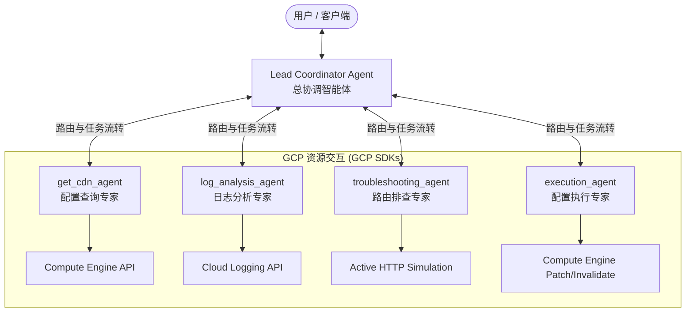

# Google Cloud CDN Diagnostic AI Team (GCP CDN 智能协同诊断团队)

本项目基于 **Google ADK 2.0 (Agent Development Kit)** 框架构建，是一套专为 **Google Cloud CDN** 打造的智能协同诊断与管理系统。系统采用 **Hub-and-Spoke (中心拓扑)** 多智能体架构，通过总协调智能体与四个专项专家智能体的密切协作，能够实现从配置发现、日志流量分析、真实请求模拟到安全配置执行的端到端自动化诊断。

---

## 1. 架构设计 (Multi-Agent Architecture)

系统采用协作式多智能体团队模式（Hub-and-Spoke）：



### 智能体角色分工

| 智能体名称 | 职责定位 | 绑定工具集 (Tools) |
| :--- | :--- | :--- |
| **coordinator_agent**<br/>(总协调者) | **中心入口**：负责解析用户输入、识别目标项目/域名/时间段、调度子专家智能体分发任务，并在获得数据后汇总、生成并向用户呈现最终的分析报告。 | `get_current_time` (用于锚定相对时间范围) |
| **get_cdn_agent**<br/>(配置查询专家) | **静态配置分析**：自动扫描项目下的负载均衡器（URL Maps）、全局转发规则（Forwarding Rules），提取关联的后端服务或后端存储桶，并逐个获取 CDN 缓存策略及参数。 | `list_load_balancers`, `get_load_balancer_config`, `get_backend_bucket_details`, `get_cdn_policy_details`, `list_global_forwarding_rules` |
| **log_analysis_agent**<br/>(日志分析专家) | **流量与错误分析**：自动依据计算的 UTC 绝对时间段查询 Cloud Logging 负载均衡访问日志，统计请求吞吐、HTTP 状态码分布、缓存命中率并采样 4xx/5xx 错误详情。 | `analyze_cloud_logging`, `get_current_time` |
| **troubleshooting_agent**<br/>(网络与模拟请求专家) | **动态链路排查**：对特定的前端入口或源站 IP 模拟 HTTP 探测请求，检验当前的缓存响应头（Headers）与返回状态码。 | `simulate_http_request` |
| **execution_agent**<br/>(安全执行专家) | **写操作执行**：支持清空 CDN 缓存（Invalidate Cache）、开启/关闭后端服务或存储桶的 CDN 配置、修改 HTTPS 强制跳转重定向、删除多余转发规则。 | `invalidate_cdn_cache`, `update_backend_service_cdn_config`, `delete_global_forwarding_rule`, `update_url_map_redirect`, `update_backend_bucket_cdn_config` |

---

## 2. 核心功能与技术亮点

* **动态多项目诊断能力**：不仅支持通过环境变量配置默认的 GCP 项目，还支持从用户自然语言中提取目标项目名称（例如 `"how about in project vic-cicd?"`），并在智能体流转中动态透传，一站式排查跨项目资源。
* **时序智能校准**：日志专家支持将自然语言的相对时间段（如 “过去3天”、“昨天”）通过 `get_current_time` 工具自动锚定到 UTC 绝对 ISO 8601 时间格式，彻底解决大模型在时序计算上的短板。
* **人工介入确认 (Human-in-the-Loop, HITL)**：凡是涉及写操作、缓存清空或删除资源等敏感工具，均在 `FunctionTool` 声明中启用了 `require_confirmation=True`。在 ADK UI/CLI 运行时会暂停并强制请求人工确认，以防误删或破坏性配置上线。
* **工具确认框架补丁 (Bug Fix)**：重构了 ADK 内置的确认解析函数 `rc._parse_tool_confirmation`。支持处理前端 UI 抛出的文本响应（如 "yes", "Approve", "cancel"），避免原生 ADK 在解析非标准 JSON 原始响应时抛出 `JSONDecodeError` 崩溃。

---

## 3. 环境准备与配置

### 基础依赖安装
确保当前工作区拥有 Python 3.10+ 并安装了以下库：
```bash
pip install -r requirements.txt
```

### Google Cloud 凭证与鉴权
智能体需要具备查询和修改 Compute Engine 和 Cloud Logging 的权限。请运行：
```bash
# 激活 Application Default Credentials (ADC) 鉴权
gcloud auth application-default login
```

### 环境变量配置
在项目根目录下配置 `.env` 文件，或在启动前声明以下环境变量：
```bash
# 目标默认 GCP 项目 ID
export GOOGLE_CLOUD_PROJECT="your-default-gcp-project-id"

# 启用 Vertex AI 后端支持 (推荐)
export GOOGLE_GENAI_USE_VERTEXAI="TRUE"
export GEMINI_REGION="global"

# 可选：如果直接使用 Google AI API (不走 Vertex AI ADC)
export GEMINI_API_KEY="your-gemini-api-key"
```

---

## 4. 使用与运行指南

### 方法一：通过 ADK Dev UI 运行 (可视化界面，推荐)
ADK 提供了一个开箱即用的本地 Web 控制台，非常适合进行交互调试 and 体验协作流转：
```bash
python3 -m google.adk.cli web .
```
启动后浏览器访问 `http://127.0.0.1:8000/dev-ui` 即可体验。

### 方法二：通过 CLI 本地运行 (命令行交互)
可以直接以脚本方式运行：
```bash
python3 agent.py
```
这将在控制台中拉起多智能体并在初始化环境验证后输出绑定的工具信息。

---

## 5. 项目结构说明

```
CDN Agent/
├── agent.py                        # 供本地 CLI / 脚本直接调试的智能体定义入口
├── README.md                       # 项目说明文档
├── requirements.txt                # 运行依赖
├── GEMINI.md                       # 开发指导手册与故障排查知识库
├── cdn agent requirement.txt       # 团队业务原始需求定义 (中文)
├── Xiaomi gcp cdn agent workflow.docx # 业务逻辑工作流文档
│
├── cdn_agent_app/                  # ADK Web 容器默认加载的目标包
│   ├── __init__.py
│   └── agent.py                    # 用于 Web UI 平台加载的智能体代码 (与根目录保持同步)
│
└── gcp_cdn_skill/                  # 核心技能工具模块
    ├── SKILL.md                    # 技能文档声明
    └── scripts/
        ├── __init__.py
        └── gcp_cdn_diagnostics.py  # 封装 GCP API (Compute, Cloud Logging) 的诊断执行 Python 库
```
